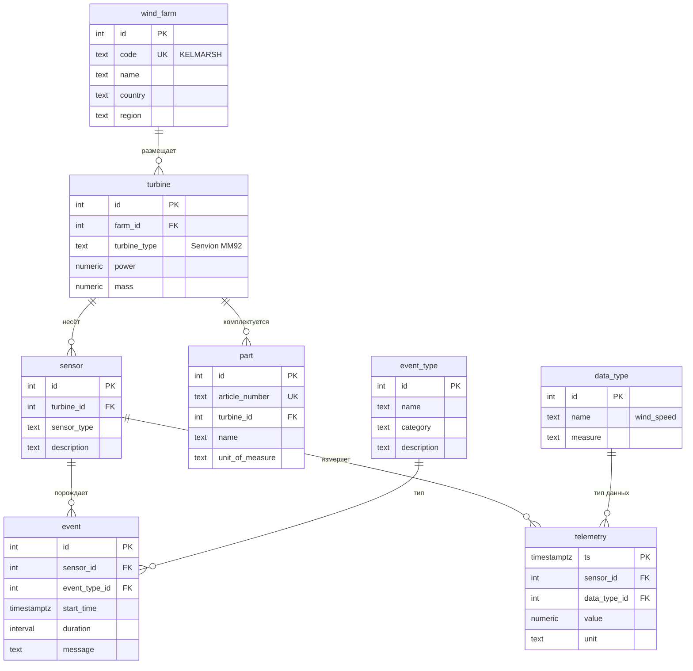

# Семинар 2 · Схема нашего проекта

Задание — [seminar02.pdf](seminar02.pdf). Пример диаграммы из лекции — [example/schema.mmd](example/schema.mmd).

## Команда и предметная область

- Команда: …
- Объект: …

## Сущности (часть 1)

| Сущность    | Естественный ключ | Атрибуты                                  | Примечание           |
|-------------|-------------------|-------------------------------------------|----------------------|
| wind_farm   | code              | name, country, region                     | KELMARSH             |
| turbine     | turbine_type      | farm_id, power, mass                      |                      |
| sensor      | sensor_type       | turbine_id, description                   | Senvion MM92         |
| data_type   |                   | name,  measure                            | wind_speed           |
| event       | -   | sensor_id, event_type_id, start_time, duration, message | Журнал событий       |
| event_type  | -                 | name, category, description               | Типы событий         |
| telemetry   | ts                | sensor_id, data_type_id, unit             | Данные за год работы |
| part        | article_number    | turbine_id, name, unit_of_measure         | Запчасти             |

## Связи

| A — B                  | Кардинальность | Обязательна?             | Атрибуты связи |
|------------------------|----------------|--------------------------|----------------|
| wind_farm - turbine    | 1:N            | Да, со стороны turbine   | -              |
| turbine - sensor       | 1:N            | Да, со стороны sensor    | -              |
| sensor - event         | 1:N            | Да, со стороны event     | -              |
| sensor - telemetry     | 1:N            | Да, со стороны telemetry | -              |
| data_type - telemetry  | 1:N            | Да, со стороны telemetry | -              |
| event_type - event     | 1:N            | Да, со стороны event_type| -              |
| turbine - part         | 1:N            | Да, со стороны part      | -              |

## Что меняется во времени

- Показания датчиков
- Events

## диаграмма «сущность — связь» (часть 2)

## Миграции (части 3 и 5)

- `migrations/V1__init.sql` — …
- `migrations/V2__….sql` — что исправили по ревью

## Взаимная проверка

Замечания к нам — [review.md](review.md). Проверка, которую сделали мы: ссылка на репозиторий другой команды.
