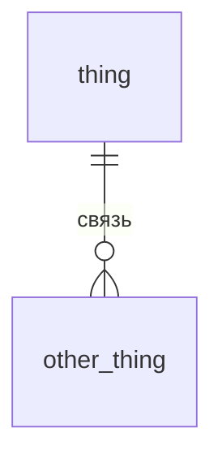

# Семинар 2 · Схема нашего проекта

Задание — [seminar02.pdf](seminar02.pdf). Пример диаграммы из лекции — [example/schema.mmd](example/schema.mmd).

## Команда и предметная область

- Команда: …
- Объект: …

## Сущности (часть 1)

| Сущность    | Естественный ключ | Атрибуты                                 | Примечание           |
|-------------|-------------------|------------------------------------------|----------------------|
| wind_farm   | code              | name, country, region                    | KELMARSH             |
| turbine     | serial_number     | farm_id, power, mass                     | Название турбины     |
| signal      | code              | turbine_id, signal_type_id, description  | wind, power          |
| signal_type | code              | name, unit_of_measure, description       | wind_speed           |
| event       | -                 | turbine_id, start_time, message          | Из журнала событий   |
| telemetry   | (signal_id, ts)   | data, value                              | Данные за год работы |
| engineer    | tabel_name        | full_name, specialization, years_of_work | "S-001"              |
| part        | article_number    | turbine_id, name, unit_of_measure        | Запчасти             |

## Связи

| A — B | Кардинальность | Обязательна? | Атрибуты связи |
|---|---|---|---|
| … | 1:N | … | … |

## Что меняется во времени

- …

## диаграмма «сущность — связь» (часть 2)

## Миграции (части 3 и 5)

- `migrations/V1__init.sql` — …
- `migrations/V2__….sql` — что исправили по ревью

## Взаимная проверка

Замечания к нам — [review.md](review.md). Проверка, которую сделали мы: ссылка на репозиторий другой команды.
